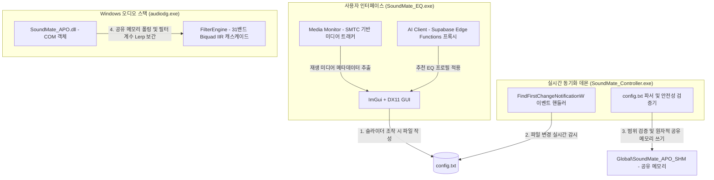

# SoundMate EQ — 전체 아키텍처 상세 설계서 및 기술 참조서

**SoundMate EQ** 프로젝트의 전체 아키텍처, 데이터 흐름, DSP 파이프라인, 배포 메커니즘을 상세히 다루는 기술 참조서입니다. Windows 11 시스템 전역 오디오 이퀄라이저를 구성하는 모든 모듈의 코드 로직을 심층 분석하고 시각화하여 기록합니다.

---

## 📐 시스템 아키텍처 개요

SoundMate EQ는 실시간 오디오 성능 보장, Windows PPL(Protected Process Light) 보안 호환성, 그리고 직관적이고 미려한 UI 환경을 유기적으로 연결하기 위해 고도로 분리된 모듈형 아키텍처로 설계되었습니다.



---

## 🎼 1. 오디오 처리 시스템: `SoundMate_APO.dll`

오디오 처리를 담당하는 핵심 모듈로, Windows의 보호된 시스템 프로세스인 `audiodg.exe`에 COM(Component Object Model) 클래스 라이브러리로 직접 로드되어 동작합니다.

### 1.1 COM 인프라 및 초기화 (`DllMain.cpp`, `ClassFactory.cpp`, `SoundMateAPO.cpp`)
- **`DllMain.cpp`**: COM DLL 등록 및 로드를 위한 4대 표준 진입점(`DllGetClassObject`, `DllCanUnloadNow`, `DllRegisterServer`, `DllUnregisterServer`)을 구현 및 노출합니다.
- **`ClassFactory.cpp`**: `IClassFactory` 인터페이스를 통해 `SoundMateAPO` COM 클래스 객체의 동적 인스턴스화를 지원합니다.
- **`SoundMateAPO.cpp` / `SoundMateAPO.h`**:
  - `IAudioProcessingObject`, `IAudioProcessingObjectRT`, `IAudioSystemEffects` 등 핵심 APO 인터페이스를 구현합니다.
  - **`Initialize`**: 디바이스 속성 스토어 파싱 및 기본 이퀄라이저 상태 등의 디바이스 특화 초기화 설정을 완료합니다.
  - **`APOProcess`**: `audiodg.exe`가 매 오디오 버퍼 슬라이스(48kHz 기준 일반적으로 512 또는 1024 샘플, 약 10ms 단위)마다 호출하는 실시간 최고 우선순위 콜백 함수입니다.

### 1.2 DSP 신호 처리 파이프라인: `FilterEngine.h`
오디오 신호 처리는 `audiodg.exe` 내부의 실시간 오디오 스레드 환경에서 동작하며, 다채널 부동 소수점(float) PCM 원본 오디오 데이터를 받아 신호를 변형합니다.

```
       [Raw Audio Input Buffer (원본 오디오 입력)]
                            │
                            ▼
         [Read Shared Memory (공유 메모리 읽기)] ──► 마스터 볼륨 및 목표 필터 계수 실시간 반영
                            │
                            ▼
         [Is EQ Active? (EQ 활성화 상태 검사)]
         ├── Yes ──► [31-Band Biquad Cascade] ──► 지퍼 노이즈 제거를 위한 선형 보간 (lerp)
         │                                       필터 상태 변수 (z1, z2) 유지 보존
         └── No  ───► [Bypass Direct Path]
                            │
                            ▼
          [DC Blocker Filter (DC 차단 필터)]   ──► 5 Hz IIR 하이패스 필터 적용
                            │
                            ▼
      [Loudness Normalizer (정규화기 - 현재 OFF)]
                            │
                            ▼
      [Hard Ceiling Guard (클리핑 방지 -0.1dB)] ──► 디지털 디스토션 제한 (min/max 클램핑)
                            │
                            ▼
           [NaN Guard (수치 오류 보호)]        ──► 결함 발견 시 Mute 및 엔진 내부 상태 재초기화
                            │
                            ▼
      [Processed Audio Output Buffer (출력 오디오)]
```

#### A. 계수 선형 보간 (지퍼 노이즈 방지)
사용자가 EQ 슬라이더를 부드럽게 드래그할 때 "틱틱" 거리는 전기적 노이즈(Zipper Noise)를 제거하기 위해, 타겟 필터 계수를 **1024 샘플**(48kHz 기준 약 21ms)에 걸쳐 미세하게 선형 보간(Linear Interpolation)합니다:
$$\alpha_{current} = \alpha_{old} + (\alpha_{target} - \alpha_{old}) \times \frac{step}{1024}$$
특히 필터 내부의 상태 변수($z_1$, $z_2$)를 보존하며 보간을 수행하여 신호의 물리적인 단절을 완벽하게 예방합니다.

#### B. DC 블로커 (DC Blocker)
초저역 통과 주파수 변동이나 회로 노이즈로 유입되는 하드웨어 DC 오프셋을 차단하기 위해 **5Hz** 차단 주파수를 지닌 IIR 하이패스 필터를 기본 구동합니다:
$$y[n] = x[n] - x[n-1] + R \times y[n-1] \quad (R \approx 0.9993)$$

#### C. NaN 가드 (NaN Guard)
수치 해석적 예외 차단 루틴입니다. 무한대(Infinity)나 정의되지 않은 수치 값(NaN)이 계산 회로에서 감염 및 전파되면, 해당 프레임을 즉각 무음(Mute) 처리하고 캐스케이드 상태 히스토리($z_1, z_2$)를 $0$으로 즉시 강제 플러싱하여 복구 불가능한 무음 상태나 시스템 크래시를 차단합니다.

---

## 📳 2. 실시간 동기화 데몬: `SoundMate_Controller.exe`

사용자용 GUI 프로그램과 시스템 APO 간의 데이터 통신을 책임지며, 파일 시스템의 데이터 변화를 실시간으로 받아 안전하게 메모리 공간에 파싱합니다.

### 2.1 파일 변경 감지 루틴 (`MainController.cpp`)
- 하드디스크 리소스를 과도하게 쓰는 주기적인 타이머 폴링 대신, Win32 API의 `FindFirstChangeNotificationW` 커널 이벤트를 대기하는 스레드를 구동합니다.
- `config.txt`가 포함된 디렉토리의 파일 쓰기가 마감되는 즉시 동기화 이벤트를 수신하여 작업을 개시합니다.

### 2.2 엄격한 파싱 및 안전성 검증
- **정규표현식 파싱**: 마스터 프리앰프 값(`Preamp: <value> dB`)과 각 EQ 밴드 설정(`Filter: <band_index> <frequency> <gain> <Q_factor>`)을 정합성 있게 추출합니다.
- **입력값 안전 가드**: 입력 값의 오버플로우나 오작동을 원천 봉쇄하기 위해 값 범위를 엄격하게 제한합니다:
  - **주파수 (Frequency)**: $20\text{ Hz} \sim 20,000\text{ Hz}$ 범위로 한계 제한.
  - **게인 (Gain)**: $-24.0\text{ dB} \sim +24.0\text{ dB}$ 범위로 클램핑.
  - **Q-팩터 (Q-Factor)**: $0.1 \sim 10.0$ 주위로 필터 대역폭 통제.
  - **수치 안전성 검사**: 파싱된 모든 부동소수점에 대해 `isnan()` 및 `isinf()` 체크를 적용하여 안정성 확보.

### 2.3 공유 메모리 인터페이스 (`SoundMate_Shared.h`)
안전하게 필터링된 구조체 값은 Win32 공유 메모리 영역인 **`Global\SoundMate_APO_SHM`**에 원자적으로 작성됩니다.
- 오디오 서비스와 유저 애플리케이션 간 권한 장벽을 해소하기 위해, **명시적인 보안 기술자(SDDL)**를 공유 메모리 생성 단계에 주입하여 Interactive User(일반 계정 실행 GUI)도 관리자 권한 승격 없이 메모리 주소를 지속적으로 수정할 수 있도록 허용합니다.

---

## 🛡️ 3. 설치 및 레지스트리 복원 시스템: `SoundMate_setup.exe` & `SoundMate_reset.exe`

오디오 드라이버와 윈도우 오디오 엔진과의 연동을 주입하고 복원하는 로직을 완전히 제어합니다.

### 3.1 셋업 유틸리티 (`src/main.cpp`, `src/migration.cpp`)
- **디바이스 상태 스캔**: 윈도우 멀티미디어 디바이스 API(`IMMDeviceEnumerator`)를 구동해 사용 중인 활성 재생 장치(스피커, 헤드폰 등)를 실시간으로 탐색합니다.
- **APO 레지스트리 인젝션**: 탐색된 활성 렌더 장치 주소 하위의 레지스트리 경로(`FxProperties`)를 타겟팅합니다:
  - 기존에 활성화되어 존재하던 원본 APO 데이터 슬롯(`{Slot5}`, `{Slot7}`, `{Slot13}`, `{Slot15}`)을 백업 메모리에 자동 카피합니다.
  - 우리 고유 CLSID인 `{1D250E82-...}` 클래스 식별자를 해당 슬롯에 정확하게 교체 주입합니다.
- **마이그레이션 및 상태 천이 (`src/migration.cpp`)**: 구버전과 신버전 간 레지스트리 구조 및 사용자 옵션 데이터를 소실 없이 스키마 기반 데이터베이스 트랜잭션처럼 정합성 있게 천이시킵니다.
- **시스템 서비스 제어**: Service Control Manager (SCM) API를 구동하여 윈도우 시스템 오디오 데몬인 `audiosrv` 및 `AudioEndpointBuilder` 서비스를 완전히 중단시킨 후 재구동함으로써 오디오 엔진인 `audiodg.exe`가 새로 설치된 바이너리를 강제로 리로드하도록 강제합니다.

### 3.2 리셋 유틸리티 (`SoundMate_Reset_Total.cpp`)
- **프로세스 정상 종료**: 백그라운드 상주 데몬(`Controller.exe`) 및 사용자 `GUI.exe` 프로세스를 깔끔하게 정돈하고 종료합니다.
- **오디오 스택 레지스트리 원복**: 백업 폴더 영역에 보존해 두었던 장치별 원본 APO 레지스트리 데이터를 원래 슬롯으로 복귀시키고 SoundMate 등록 레코드를 일소합니다.
- **시스템 찌꺼기 청소**: `C:\Program Files\SoundMate Equalizer\` 및 공용 폴더에 할당된 바이너리, 로그 데이터, 캐시 등 전 영역의 파일을 말끔히 삭제합니다.

---

## 🎨 4. Direct3D ImGui UI 애플리케이션: `SoundMate_EQ.exe`

사용자가 마주하는 직관적이고 고성능의 31밴드 EQ 콘솔로, DX11 하드웨어 가속 기반의 Dear ImGui 렌더링 프레임워크로 구동됩니다.

```
                   [SoundMate_EQ.exe 진입점]
                               │
                               ▼
        [DirectX 11 장치 초기화 및 윈도우 컨텍스트 생성]
                               │
                               ▼
        [Controller.exe 프로세스 상태 감지 및 부재 시 자동 기동]
                               │
                               ▼
               ┌───────────────┴───────────────┐
               ▼                               ▼
     [GUI 메인 렌더링 루프 스레드]        [백그라운드 디바이스 모니터 스레드]
     - 31밴드 게인 슬라이더 렌더링        - SMTC 기반 재생 정보 캡처 (MediaMonitor)
     - 이퀄라이저 응답 곡선 실시간 묘화   - 엔진 상태 주기 진단 (HealthMonitor)
     - 사용자 연동 로그인 & 설문 처리     - iTunes API 비동기 장르 해석기
               │                               │
               └───────────────┬───────────────┘
                               ▼
             [사용자의 조작 또는 AI 프리셋 주입 완료]
                               │
                               ▼
           [config/config.txt 파일 시스템 쓰기 개시]
```

### 4.1 SMTC 트래킹 및 음원 장르 분석 (`core/MediaMonitor.cpp`, `core/GenreManager.cpp`)
- **윈도우 미디어 API 바인딩**: WinRT `SystemMediaTransportControls`에 이벤트 구독기를 등록하여 Chrome, Spotify 등 전역 프로세스에서 흘러나오는 노래명과 가수명 메타데이터를 정합성 있게 탈취합니다.
- **비동기 장르 해석**: 추출된 메타데이터를 바탕으로 iTunes Search API에 검색을 요청하여 음원의 메인 장르 정보를 안전하게 확인합니다.

### 4.2 AI 이퀄라이저 프록시 연동 (`core/AIClient.cpp`)
- Supabase Edge Functions 서버 환경과 API 연동을 취하여, 사용자가 앱 가입 초기 단계에 지정한 청각적 취향 데이터와 현재 실시간 감지된 미디어의 장르 정보를 취합해 최적의 추천 31밴드 Target Curve 데이터셋을 비동기 수신합니다.
- 수신 즉시 GUI 슬라이더 좌표를 부드럽게 타겟 곡선으로 강제 모핑 및 업데이트하여 `config.txt`로 내보냅니다.

### 4.3 엔진 건전성 실시간 진단 (`core/EngineHealthMonitor.cpp`)
- **1.5초 주기 지속 모니터링**:
  - `SoundMate_Controller.exe` 프로세스가 작동 정지 중인지 파악.
  - 전역 공유 메모리 핸들이 탈취 가능한 상태인지 감시.
  - 오디오 드라이버에 정상 신호 데이터 전파가 끊겼는지 감지.
  - 문제 발견 시 GUI 헤더 영역에 경고창(Warning Notice)을 동적으로 즉시 주입 및 시각화합니다.

---

## 📦 5. 설치 패키지 인스톨러 스크립트: `SoundMate_Setup.iss`

Inno Setup을 기반으로 하여 분산 컴파일된 바이너리를 단일 설치 번들 패키지 파일(`SoundMate_Setup_v0.0.2.exe`)로 묶어냅니다.

### 5.1 샌드박스 스테이징(Sandbox Staging) 수명 주기
`audiodg.exe`가 기존 재생 스택 상에서 구버전 드라이버 DLL 파일을 물리적으로 강하게 붙들고 잠금 상태를 유지하는 한계점을 극복하기 위해, 설치 시 스테이징 기법을 구동합니다:

```
[설치 프로세스 시작]
        │
        ▼
[Files 복사 섹션] ──► 임시 샌드박스 폴더인 {app}\_tmp_install\ 디렉토리로 파일 1차 배치
        │             (새 주소이므로 audiodg가 락을 걸 수 없어 복사가 100% 무조건 성공함)
        ▼
[ssPostInstall 설치 후반부 이벤트]
        │
        ├──► 기존 드라이버 업그레이드 설치 케이스인가?
        │       ├── Yes ──► 원자적 ReplaceFileW() API 가동
        │       │             ├── 복사 성공 ──► 완료 (재부팅 불필요)
        │       │             └── 복사 실패 ──► MoveFileExW(DELAY_UNTIL_REBOOT)에 예약 등록 후 재부팅 알림 설정
        │       └── No  ───► 즉각적인 파일 이동 (RenameFile) 수행
        ▼
[최종 정리 작업] ──► _tmp_install 디렉토리를 완전 삭제하여 스틸 파일 충돌 원천 제거
```

### 5.2 완전 격리 롤백 메커니즘
설치 과정에서 유저 이탈이나 시스템 파행으로 에러가 날 시, 설치 후반부 청소 루프인 `DeinitializeSetup`에서 스테이징 전용 폴더인 `_tmp_install` 자체를 물리적으로 지워냅니다. 이렇게 소스 원본 파일이 영구 결손될 시, Windows 커널 스택에 등재되어 있던 `MoveFileExW`의 재부팅 지연 실행 대기 명령은 커널 메모리 단에서 `STATUS_OBJECT_NAME_NOT_FOUND` 예외로 처리되며 시스템에 단 하나의 오염 흔적도 남기지 않고 파기(롤백)됩니다.

---

## 🛠️ 컴파일 및 개발 실행 가이드

### 환경 및 준비 요건
- **Visual Studio 2022/2025** (C++ 데스크톱 개발 컴파일 도구 도구셋 설치 필수)
- **Windows 10/11 SDK (10.0.22000 이상)**
- **CMake (3.20 이상)**

### 원스톱 빌드 파이프라인 주행
터미널을 열고 아래 지시어를 순서대로 실행하면 전체 바이너리 컴파일부터 최종 인스톨러 생성까지 일괄적으로 처리할 수 있습니다:

```powershell
# 1. NMake 빌드 환경 구성 (릴리즈 배포용 정의)
cmake -S . -B build -G "NMake Makefiles" -DCMAKE_BUILD_TYPE=Release

# 2. C++ 핵심 모듈 컴파일 진행 (DLL 및 전체 EXE 실행파일군)
cmake --build build

# 3. 인스톨러 번들 패키징 실행
cmake --build build --target Installer
```

최종 빌드된 배포판 설치기 패키지는 아래 주소에 자동으로 안착합니다:
`C:\SoundMate_EQ\installer_output\SoundMate_Setup_v0.0.2.exe`

---

© 2026 SoundMate Team. All rights reserved.
